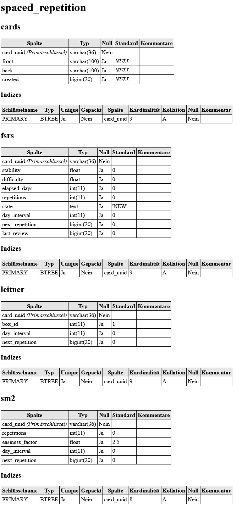
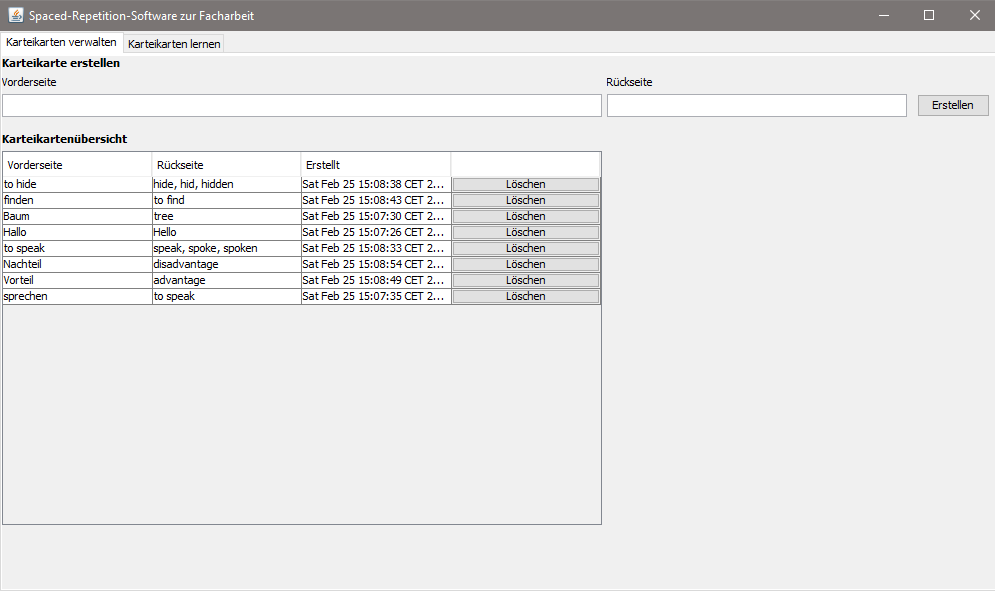
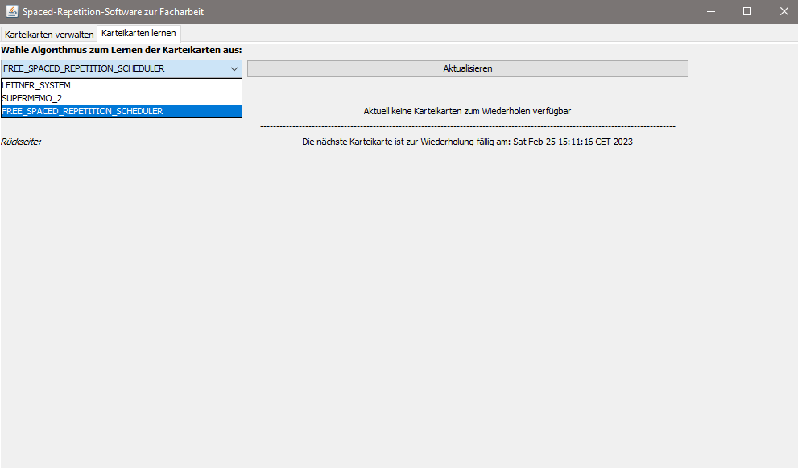
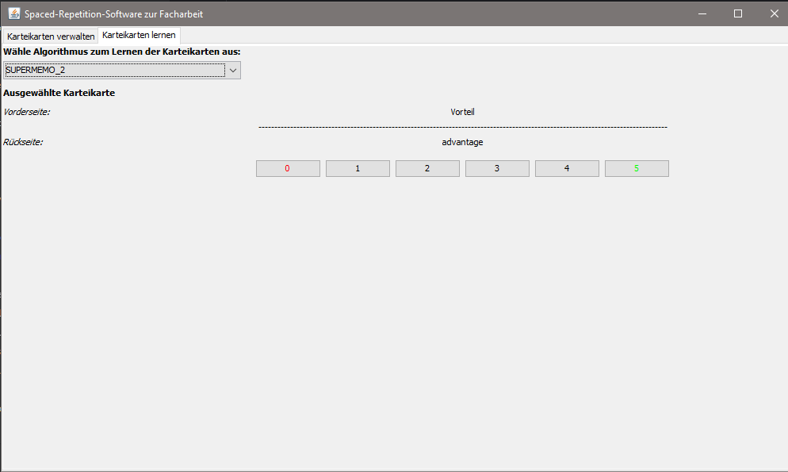

# Java Spaced Repetition API
[](https://github.com/nickhnsn/facharbeit-spaced-repetition/blob/master/LICENSE)
[](https://www.codefactor.io/repository/github/nickhnsn/facharbeit-spaced-repetition)
[](https://jitpack.io/#nickhnsn/facharbeit-spaced-repetition)

###

<p align="center">
	<h3 align="center">Java Spaced Repetition API</h3>
    <p align="center">
       Java Spaced Repetition API with an example for a spaced repetition software prototype
       <br/>
       <a href="https://github.com/nickhnsn/facharbeit-spaced-repetition/releases" target="_blank">Releases</a> 
        · 
       <a href="https://facharbeit.nickhansen.de/" target="_blank">Javadoc</a> 
</p>

###

## About the project


This GitHub repository is part of my German school paper in Computer Science (German "Facharbeit im Fach Informatik"). As a part of my school paper, I implemented an API for three spaced repetition algorithms which can be used by any spaced repetition software. An example for the productive usage of the API can be found in the implemented software.

## API
The API contains the [SuperMemo SM-2 algorithm](https://super-memory.com/english/ol/sm2.htm), also an algorithm according to [Sebastian Leitner's system](https://en.wikipedia.org/wiki/Leitner_system) and the [Free Spaced Repetition Scheduler (FSRS)](https://github.com/open-spaced-repetition/free-spaced-repetition-scheduler).

### Download

Feel free to use the API in your own software:

**Maven**

Add the repository in your ``pom.xml`` to the repositories:
```xml
<repositories>
    <repository>
        <id>jitpack.io</id>
        <url>https://jitpack.io</url>
    </repository>
</repositories>
```
Add the dependency in your ``pom.xml`` to the dependencies:
```xml
<dependency>
    <groupId>com.github.nickhnsn.facharbeit-spaced-repetition</groupId>
    <artifactId>spaced-repetition-api</artifactId>
    <version>v1.0.0</version>
</dependency>
```

**Gradle**

Add it in your root ``build.gradle`` at the end of the repositories:
```gradle
allprojects {
    repositories {
        ...
        maven { url 'https://jitpack.io' }
    }
}
```
Add the dependency to your ``build.gradle``:
```gradle
dependencies {
    implementation 'com.github.nickhnsn.facharbeit-spaced-repetition:spaced-repetition-api:v1.0.0'
}
```

### Usage
The API uses a builder system with a fluent interface since the algorithms have many parameters. This system also makes it possible to leave algorithm parameters out and fall back to their default values:
```java
// Create the algorithm object
SM2Algorithm sm2 = SM2Algorithm.builder()
                .quality(3)
                .repetitions(4)
                .easinessFactor(1.6F)
                .interval(5)
                .build();

// Calculate the outputs based on the inputs from object creation
SM2AlgorithmResult result = sm2.calc();
```
Examples for the other algorithms can be found in the [SpacedRepetitionAPI.java](https://github.com/nickhnsn/facharbeit-spaced-repetition/blob/master/spaced-repetition-api/src/main/java/de/nickhansen/spacedrepetition/api/SpacedRepetitionAPI.java). The method ``AlgorithmResult#calc`` returns an object with multiple getters, namely the algorithm outputs. These outputs need to be stored in some way since they are required for the next algorithm usage.
Suggested database structure (in this case for MySQL):



## Software
The software is a prototype/example for a Spaced Repetition Software in which this API is used. You can have a look at it for an inspiration in case you want to use this API or you are developing an own software.

### Setup
A Java Version >= 8 is required as well as an active MySQL instance.
1. **Build the software:** ``mvn package``
2. **Configuration of the database connection:** Edit the ``config.properties`` in the project and build it with ``mvn package``  or create a ``config.properties`` file in the same folder the software is executed.
3. **Execute the software:** ``java -jar spaced-repetition-software-1.0-SNAPSHOT.jar``

### Screenshots



## License
This project is licensed unter the terms of the [GNU General Public License v3.0](https://github.com/nickhnsn/facharbeit-spaced-repetition/blob/master/LICENSE)

## Contact
If you have any questions about this project, please feel free to create an issue.